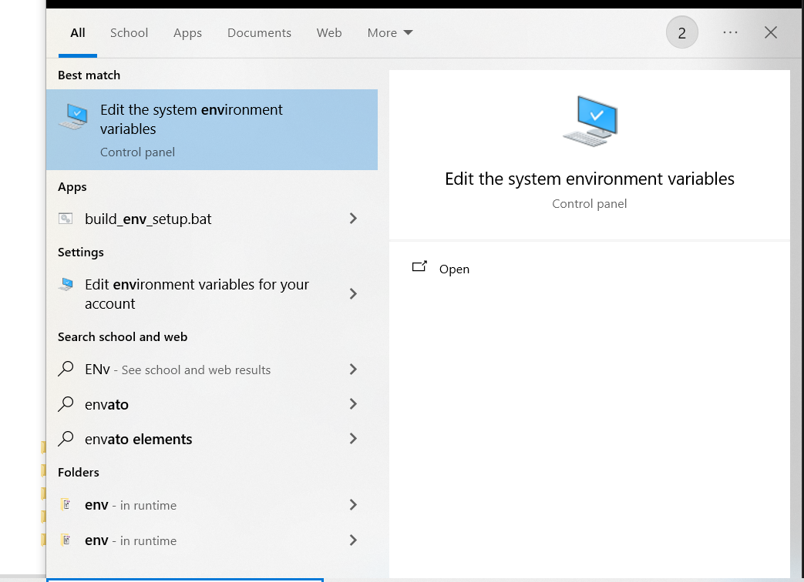
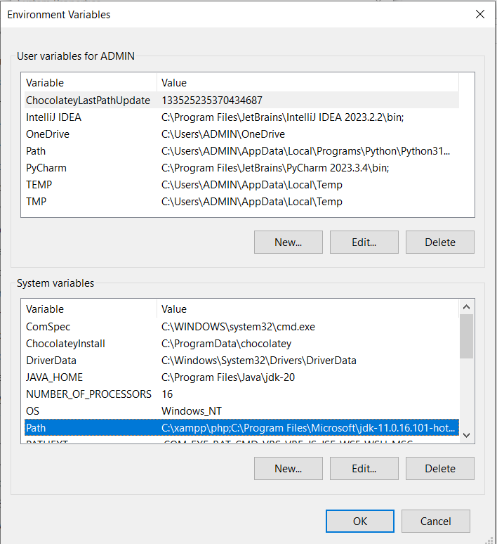
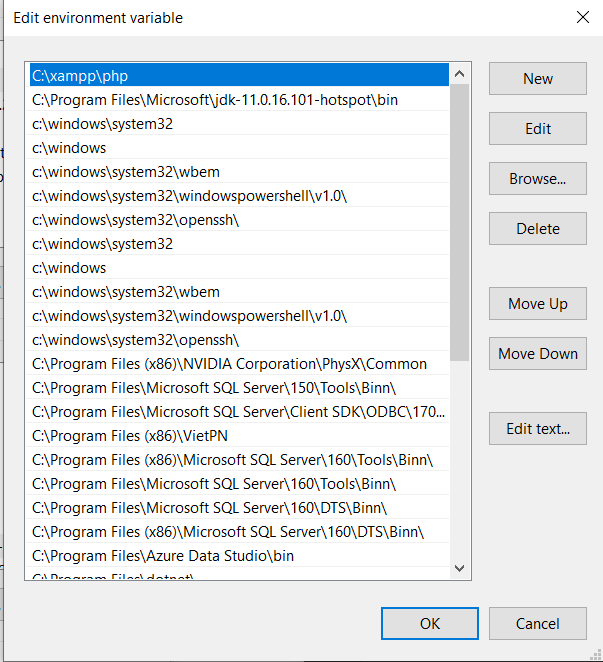
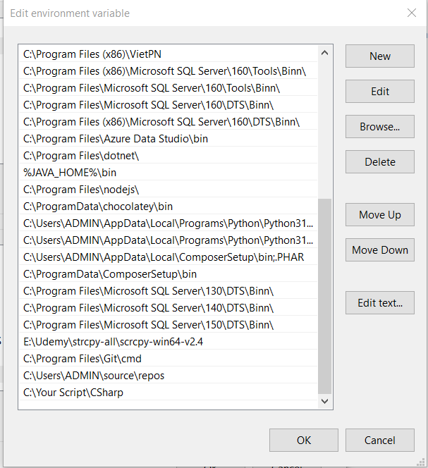

# MyScript

My own script to programming faster

## How do you use CSharp Scripts:

1. Search Enviroment Variables in the Window Search, then Open it!
   
   
2. Look for Path, then press Edit
   
3. Click New
4. Then Add your link to CSharp folder of this repo
   
